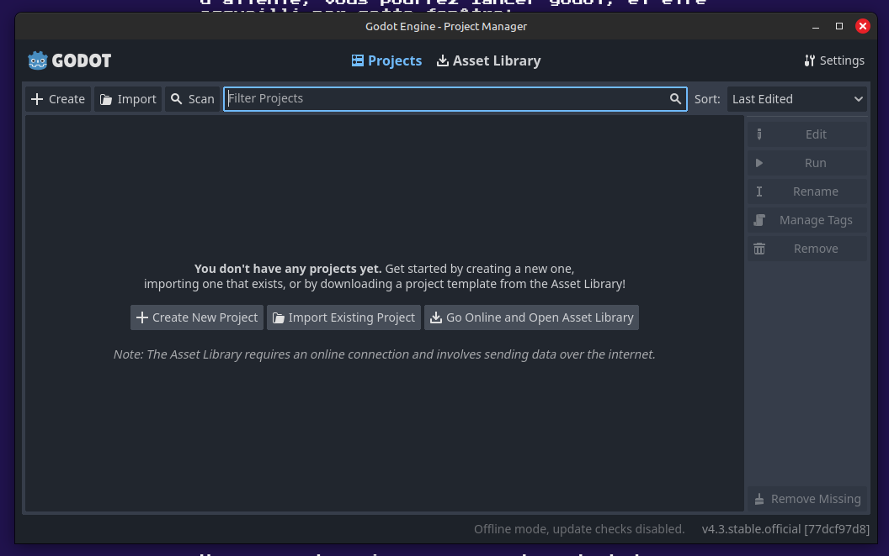
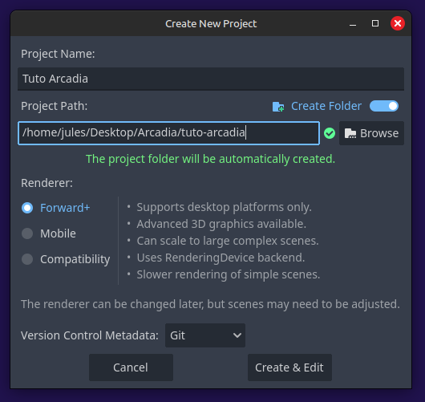
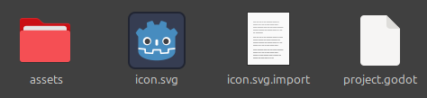
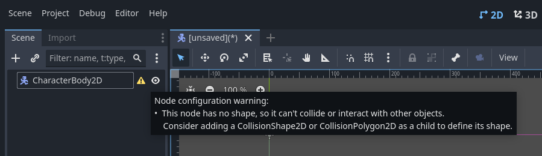
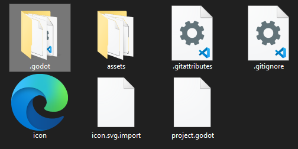

Séance 1
=====

.. _installation de Godot:

Installation de Godot
------------

Pour commencer ce tutoriel, il vous faudra installer Godot. Pour cela, vous pouvez cliquer `ici <https://godotengine.org/download/>`_ pour télécharger la dernière version de Godot (ce tuto a été écrit à la version 4.3).
Une fois le fichier .zip téléchargé et dézippé, vous pouvez lancer Godot. Vous verrez quelque chose comme ça:

Création de votre premier projet
------------

Cette fenêtre s'appelle le `Project Manager`. C'est ici que vous trouverez vos différents projets une fois que vous les aurez créés.
Actuellement, le Project Manager est vide, donc créons notre premier projet.

.. note::
   Pour ce tutoriel, les screenshots et les termes que nous utiliserons seront en anglais.
   Libre à vous bien sûr de mettre votre éditeur dans la langue de votre choix, mais il se peut que certains boutons n'aient pas les mêmes libelés.
   Vous pouvez changer la langue de l'éditeur dans les paramètres an haut à droite du Project Manager.

Cliquer sur le bouton "New" en haut à gauche.
Un popup s’ouvrira, en vous demandant des informations sur votre projet. Nommez votre projet "Tuto Arcadia" (1), et choisissez le fichier dans lequel vous voulez qu’il soit stocké (2).

Laissez les autres paramètres comme ils sont pour l'instant, et créez votre projet. Une nouvelle fenêtre devrait se lancer.
C'est la fenêtre principale de Godot, celle où vous aller tout faire sur vos jeux.

L'éditeur
------------

Cette fenêtre s'appelle l'éditeur.
Dans cette sous-partie, nous allons décrire les différents éléments qui composent l'éditeur.

1. En bas à gauche, vous trouverez l'arborescence. Il s'agit en réalité du dossier que vous venez de créer en créant le projet.
Vous pouvez le retrouver sur votre ordinateur en suivant le chemin que vous aviez mis plus tôt.

2. Juste au dessus, en haut à gauche, on trouve l'arborescence des scènes

3. Blabla décrire la fenêtre de l'éditeur...

4. A droite c'est l'inspecteur

Commençons!
------------

Déjà, mettez le pack d'assets téléchargé plus tôt dans votre projet (disponible ici si c'est pas encore fait (mettre le lien)).
Vous devriez avoir un dossier qui doit contenir au moins les choses suivantes:

Dans cette première partie du tutoriel, nous allons créer le joueur, lui ajouter des animations et des mouvements basiques.

En haut à gauche, créez une nouvelle scène en cliquant sur le bouton 'Other Node' ou le bouton '+'. Ajoutez un ''CharacterBody2D''.
Le noeud CharacterBody2D devrait apparaître dans l'arborescence, et l'éditeur devrait être passé en mode 2D.
Avant toute chose, sauvegardez votre nouvelle scène en appuyant sur ''Ctrl+S''. Vous pouvez créer un dossier ''scenes'' dans votre projet, et y enregistrer la scène du joueur en l'appellant ''player.tscn''.

Trucs à effacer:
------------

Cliquez sur le bouton Create pour créer un nouveau projet. Vous pouvez l'appeler quelque chose comme 'Tuto Arcadia'.
Pour le reste, laissez les settings par défaut.

.. note::
   Pour ce projet, nous utiliserons des assets graphiques déjà fait pour nous faciliter la tâche. Vous pouvez les télécharger ici.

Votre dossier où se trouve le projet devrait ressembler à ça:

.. code-block:: console

   (.venv) $ pip install lumache

Creating recipes
----------------

To retrieve a list of random ingredients,
you can use the ``lumache.get_random_ingredients()`` function:

.. autofunction:: lumache.get_random_ingredients

The ``kind`` parameter should be either ``"meat"``, ``"fish"``,
or ``"veggies"``. Otherwise, :py:func:`lumache.get_random_ingredients`
will raise an exception.

.. autoexception:: lumache.InvalidKindError

For example:

>>> import lumache
>>> lumache.get_random_ingredients()
['shells', 'gorgonzola', 'parsley']
