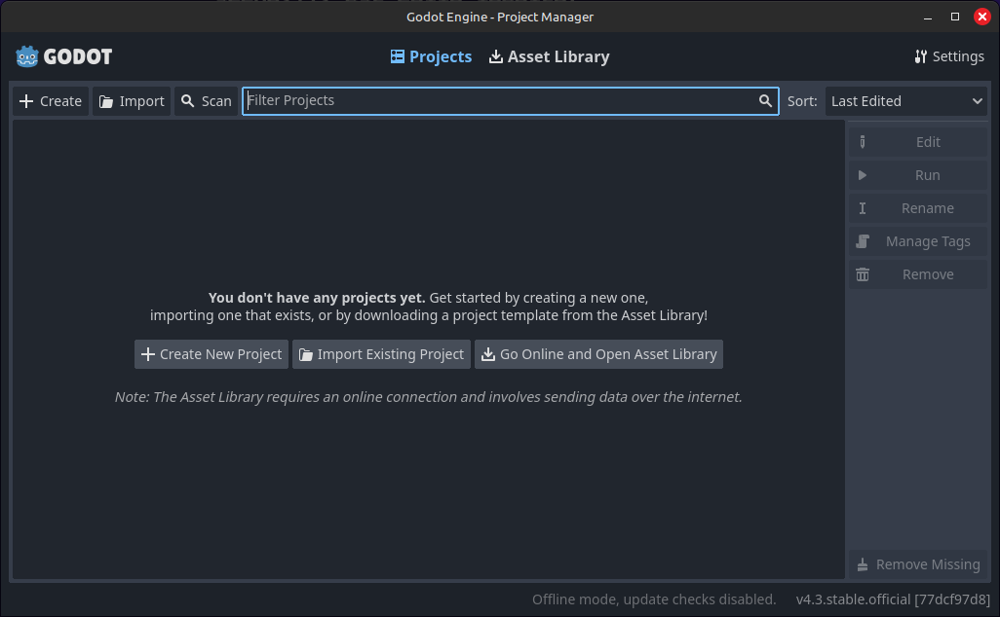

Séance 1
=====

.. _installation de Godot:

Installation de Godot
------------

Pour commencer ce tutoriel, il vous faudra installer Godot. Pour cela, vous pouvez cliquer `ici <https://godotengine.org/download/>`_ pour télécharger la dernière version de Godot (ce tuto a été écrit à la version 4.3).
Une fois le fichier .zip téléchargé et dézippé, vous pouvez lancer Godot. Vous verrez quelque chose comme ça:

Création de votre premier projet
------------

Cette fenêtre s'appelle le `Project Manager`. C'est ici que vous trouverez vos différents projets une fois que vous les aurez créés.
Actuellement, le `Project Manager` est vide, donc créons notre premier projet.

.. note::
   Pour ce tutoriel, les screenshots et les termes que nous utiliserons seront en anglais.
   C'est généralement un meilleur choix de tout mettre en anglais lorsqu'on programme, et la documentation sur internet est plus fournie en anglais qu'en français.
   Libre à vous bien sûr de mettre votre éditeur dans la langue de votre choix, mais il se peut que certains boutons n'aient pas les mêmes libellés chez vous.
   Vous pouvez changer la langue de l'éditeur dans les `Paramètres` en haut à droite du `Project Manager`, ou dans `Editor Settings` dans l'éditeur.

Cliquer sur le bouton **New** en haut à gauche.
Un popup s’ouvrira, en vous demandant des informations sur votre projet. Nommez votre projet ``Tuto Arcadia`` (1), et choisissez le fichier dans lequel vous voulez qu’il soit stocké (2).

.. image:: img/newproject.png

Laissez les autres paramètres comme ils sont pour l'instant, et créez votre projet. Une nouvelle fenêtre devrait se lancer.
C'est la fenêtre principale de Godot, l'éditeur, celle où vous aller tout faire sur vos jeux.

L'éditeur
------------

Dans cette sous-partie, nous allons décrire les différents éléments qui composent l'éditeur.

1. En bas à gauche, vous trouverez l'arborescence. Il s'agit en réalité du dossier que vous venez de créer en créant le projet.
Vous pouvez le retrouver sur votre ordinateur en suivant le chemin que vous aviez mis plus tôt.

2. Juste au dessus, en haut à gauche, on trouve l'arborescence des scènes

3. Blabla décrire la fenêtre de l'éditeur...

4. A droite c'est l'inspecteur

Commençons!
------------

Maintenant que vous avez créé votre projet, et que vous connaissez l'éditeur, commençons à créer notre premier jeu!

Déjà, mettez le pack d'assets téléchargé plus tôt dans votre projet (disponible ici si c'est pas encore fait (mettre le lien)).
Vous devriez avoir un dossier qui doit contenir au moins les choses suivantes:

Dans cette première partie du tutoriel, nous allons créer le joueur, lui ajouter des animations et des mouvements basiques.

En haut à gauche, créez une nouvelle scène en cliquant sur le bouton **Other Node** ou le bouton **+**. Ajoutez un ``CharacterBody2D``.
Le noeud CharacterBody2D devrait apparaître dans l'arborescence, et l'éditeur devrait être passé en mode 2D.
Avant toute chose, sauvegardez votre nouvelle scène en appuyant sur ``Ctrl+S``. Vous pouvez créer un dossier ``scenes`` dans votre projet, et y enregistrer la scène du joueur en l'appellant ``player.tscn``.

À droite du ``CharacterBody2D``, vous devriez apercevoir un icône de warning. Si vous mettez votre souris dessus, vous verrez le message suivant:

`"Ce nœud n'a pas de forme, il ne peut donc pas entrer en collision ou interagir avec d'autres objets.
Envisagez d'ajouter un CollisionShape2D ou un CollisionPolygon2D en tant qu'enfant pour définir sa forme."`

Qu'il en soit ainsi, ajoutons un ``CollisionShape2D`` en cliquant sur l'icône **+** en haut à gauche, en appuyant sur ``Ctrl+A`` ou encore en faisant: **Clic-droit -> Ajouter un nœud** sur le ``CharacterBody2D``.

Le nœud ``CollisionShape2D`` est utilisé pour ajouter des hitbox (aka des boîtes de collision). C'est la chose qui permettra à notre joueur d'interagir physiquement avec le monde autour de lui.
Après avoir ajouté la CollisionShape2D, vous devriez avoir un autre warning disant que la ``CollisionShape2D`` n'a pas de forme.
Pour ajouter une shape, cliquez sur le nœud ``CollisionShape2D``. Vous verrez alors que l'inspecteur, à droite de l'écran, affiche des informations sur la ``CollisionShape2D``.
Ajouter une ``CapsuleShape2D`` dans l'attribut ``shape``, qui est normalement vide. Vous devriez voir un espèce de Tic-Tac bleu au milieu de votre écran, c'est la shape.
Vous pouvez changer sa taille avec les petits cercles oranges, mais on fera ça un tout petit peu plus tard.

Ajoutons maintenant un sprite à notre joueur. Un sprite, c'est tout simplement une texture 2D, c'est ce que vous voyez sur votre écran.
On veut que notre joueur ait des animations, donc ajoutez un nœud ``AnimatedSprite2D`` au joueur.
Faites attention à ce que le nœud soit un enfant du ``CharacterBody2D``, et non de la ``CollisionShape2D``. En effet, on ne veut pas ajouter un sprite à notre collision, on veut ajouter un sprite à notre joueur.
Si le nœud est mal placé dans l'arborescence, vous pouvez le drag-n-drop (restez appuyé sur le nœud et glissez-le) sur le nœud joueur.
Vous pouvez aussi renommer le nœud du joueur en ``Player``. Après ça, vous devriez avoir une arborescence comme ça:

Encore un warning! Cette fois-ci sur l'``AnimatedSprite2D``. Ajoutez donc un ``SpriteFrames``, comme le recommande le warning.

.. rappel::
   Pour ajouter un nouveau ``SpriteFrames``, cliquez d'abord sur l'``AnimatedSprite2D`` dans l'arborescence.
   Vous aurez alors accès aux propriétés du nœud dans l'inspecteur, qui se trouve à droite de votre fenêtre.

Après avoir ajouté un nouveau ``SpriteFrames``, une nouvelle fenêtre devrait apparaître en bas de votre écran.
Si ce n'est pas le cas, cliquez sur le ``SpriteFrames`` que vous venez de créer dans l'inspecteur.

.. image:: img/spriteframesopened.png

Cette fenêtre est l'éditeur d'animations. Vous pouvez le fermer et le réouvrir en cliquant sur `SpriteFrames` en bas de l'écran.
À gauche, vous trouverez une liste de toutes les animations disponibles. Pour l'instant, il n'y en a qu'une, elle s'appelle ``"default"``.
Renommez-la ``"idle"``.

.. note::
   Une animation d'idle, c'est l'animation qui se joue quand le personnage ne bouge pas.
   Généralement, elle représente le personnage qui respire, pour ajouter du mouvement à l'image et pour faire vivre le jeu.
   Dans certains jeux, si vous attendez suffisamment longtemps, des animations spéciales vont se jouer: le personnage qui se gratte la tête, ou qui s'asseoit par terre ou s'endort...

Cliquez ensuite sur l'icône de grille [À suivre]

Trucs à effacer:
------------

Cliquez sur le bouton Create pour créer un nouveau projet. Vous pouvez l'appeler quelque chose comme ``Tuto Arcadia``.
Pour le reste, laissez les settings par défaut.

.. note::
   Pour ce projet, nous utiliserons des assets graphiques déjà fait pour nous faciliter la tâche. Vous pouvez les télécharger ici.

Votre dossier où se trouve le projet devrait ressembler à ça:

.. code-block:: console

   (.venv) $ pip install lumache

Creating recipes
----------------

To retrieve a list of random ingredients,
you can use the ``lumache.get_random_ingredients()`` function:

.. autofunction:: lumache.get_random_ingredients

The ``kind`` parameter should be either ``"meat"``, ``"fish"``,
or ``"veggies"``. Otherwise, :py:func:`lumache.get_random_ingredients`
will raise an exception.

.. autoexception:: lumache.InvalidKindError

For example:

>>> import lumache
>>> lumache.get_random_ingredients()
['shells', 'gorgonzola', 'parsley']
