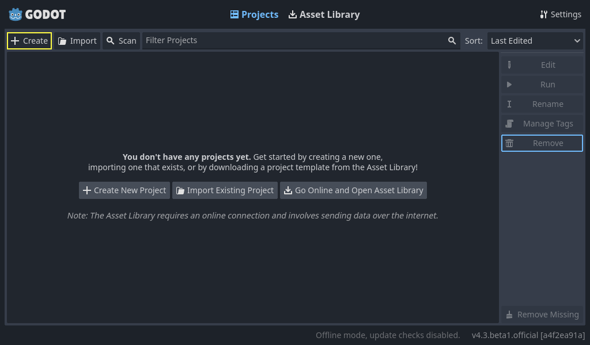

Séance 1
=====

.. _installation de Godot:

Installation
------------

Pour installer Godot, cliquer `ici <https://godotengine.org/download/windows/>`.

Dézippez le dossier, et lancez Godot.exe, vous devriez avoir quelque chose comme ça:

Cliquez sur le bouton Create pour créer un nouveau projet. Vous pouvez l'appeler quelque chose comme 'Tuto Arcadia'.
Pour le reste, laissez les settings par défaut.

.. note::
   Pour ce projet, nous utiliserons des assets graphiques déjà fait pour nous faciliter la tâche. Vous pouvez les télécharger ici.

Votre dossier où se trouve le projet devrait ressembler à ça:

.. image:: img/screen_folder.png

.. code-block:: console

   (.venv) $ pip install lumache

Creating recipes
----------------

To retrieve a list of random ingredients,
you can use the ``lumache.get_random_ingredients()`` function:

.. autofunction:: lumache.get_random_ingredients

The ``kind`` parameter should be either ``"meat"``, ``"fish"``,
or ``"veggies"``. Otherwise, :py:func:`lumache.get_random_ingredients`
will raise an exception.

.. autoexception:: lumache.InvalidKindError

For example:

>>> import lumache
>>> lumache.get_random_ingredients()
['shells', 'gorgonzola', 'parsley']
